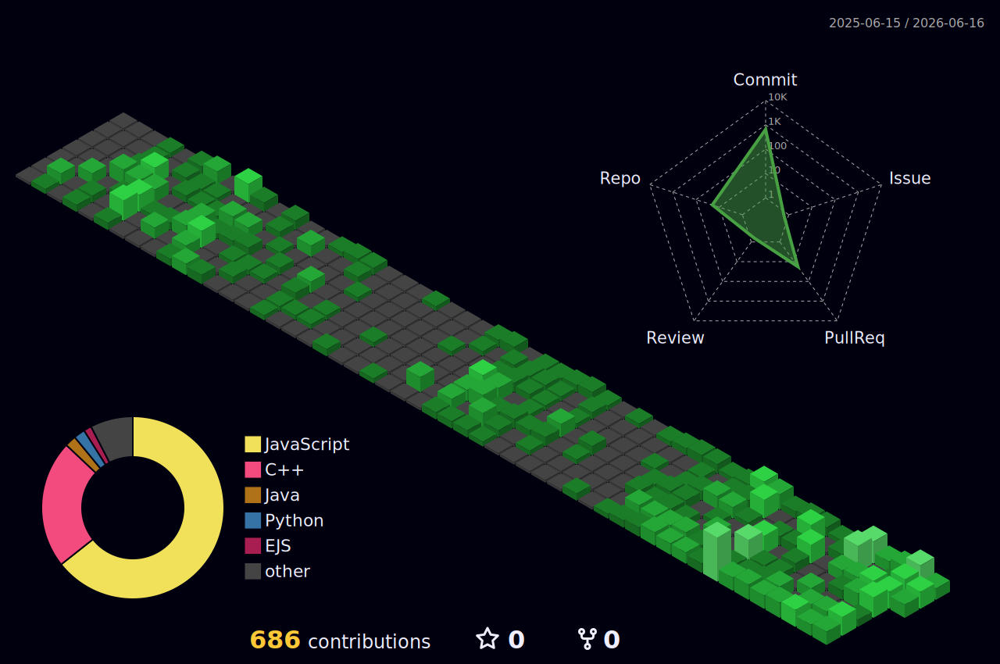

  

  

## 🧠 What I Build

- 🔐 Secure backend systems with JWT authentication, API validation & rate limiting
- ⚙️ Scalable REST APIs with clean structure and proper error handling
- 💬 Scalable frontend apps
- 🧩 Modular middleware solutions that integrate easily into existing backends
- 📊 API driven applications with clear architecture

- ## 🧰 Tech Stack

  

## 🚀 Featured Projects

🔐 [**API Security Middleware**](https://github.com/mallicksoumik1711/Api-protection-platform)   
→ JWT auth + rate limiting system  
→ Plug-and-play for any backend  

💬 [**React Chatbot UI**](https://github.com/mallicksoumik1711/Ollama-Chatbot)   
→ Fully responsive (mobile + desktop)  
→ Sidebar overlay + real-time messaging 

🎨 [**RealTime Collaborative Whiteboard**](https://github.com/mallicksoumik1711/Realtime_Draw)   
→ Multi-user collaborative canvas using WebSockets  
→ Live drawing sync across clients 

  

## 📊 My GitHub Contributions (3D)

